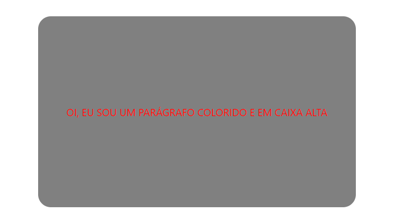

# Meu primeiro React App

## Objetivo do projeto

Esse projeto teve como objetivo um teste de conhecimento básico sobre react.

### `Desafios`

Eu percebi que tive um pouco de dificuldade quando a estilização no começo, porém ao longo do projeto e revisando 
as aulas, foi bem tranquilo e a dificuldade foi sanada

### `O que achei?`

Eu gostei bastante da biblioteca react, mesmo que acabei de começar, ela abre um leque de ideias para projeto enorme,
estou ansioso para projetar novas ideias usando essa biblioteca.

### `documentação do React`

Você pode ver a documentação [aqui](https://pt-br.legacy.reactjs.org/docs/getting-started.html) para mais informações.
